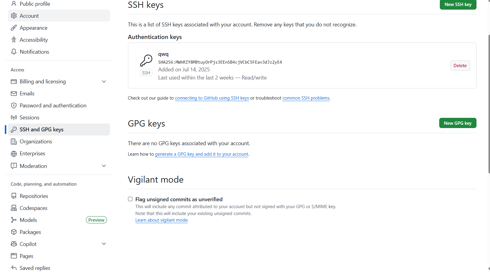
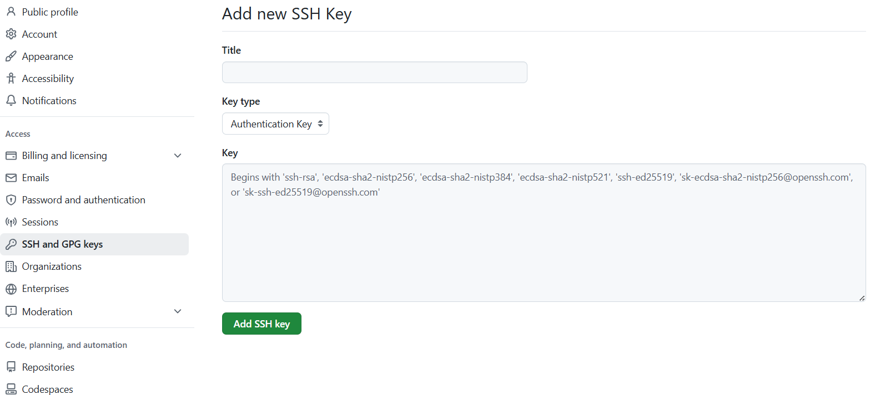

# 前言
本文教你如何使用 Valaxy 与 Github 搭建自己的博客。

<!-- more -->

# 什么是 Valaxy
Valaxy 是新一代（或者说下一代）的博客框架。

对于博客框架，可能 Hexo 的名声更大一点，但是 Valaxy 相较于 Hexo 而言，

- Hexo 的工作流与开发体验已开始落后
- 它与 Hexo 相比开发体验和速度上都更胜一筹
- Valaxy 最突出的优势在于它的热更新开发体验与可定制性，但你编写文章或博客配置时，你只需要保存，所有的变更将会即刻显示在页面上，几乎无需等待！

# 准备工作

## 安装运行环境

你需要的软件：

- Node.js [下载链接](https://nodejs.cn/en/download) 建议下载长期支持（LTS）版本。
- Git [下载链接](https://git-scm.com/downloads/win) 安装过程一路下一步就好了。

打开命令行，输入 `npm -version` 与 `git -v`，如果有输出，那么说明你安装成功了！

Tips：如果提示“此系统上禁止运行脚本”，可以打开终端管理员输入以下命令再试试
```
​​​​​​Set-ExecutionPolicy -Scope CurrentUser -ExecutionPolicy RemoteSigned
```

## 配置 Git

~~（注册Github应该有手就行了吧）~~

本文将使用Github page进行部署到互联网上，因此需要把电脑上的 Git 与 Github 账户进行绑定。

打开一个你喜欢终端，依次输入如下命令（英文引号 '"' 不用省略）：
```
git config --global user.name "github 用户名"
git config --global user.email "github 注册邮箱"
```

```
# 生成 ssh 密钥
# 输入后一路enter下去
ssh-keygen -t rsa -C "github 注册邮箱"
```
如果你是windows用户，用户名是中文的话，这一步可能会出现各种错误，唯一的办法好像就是使用Powershell了（

上一步指令生成了 ssh 密钥，找到它并**复制下来**（一般情况下在 C:\Users\你的用户名\\.ssh\id_rsa.pub）文件里，格式差不多长这样
```
ssh-rsa XXXXXXXXXXXXXXXXXXXXXXXXXXXXXX
```

打开(Github官网)[https://github.com/]，登录账号，打开设置（settings）->Access->SSH and GPG Keys



点击 “New SSH key” 输入上面复制的密钥到“Key”里，然后再点击“Add SSH key”



验证：在终端输入
```
ssh -T git@github.com                                                   
```