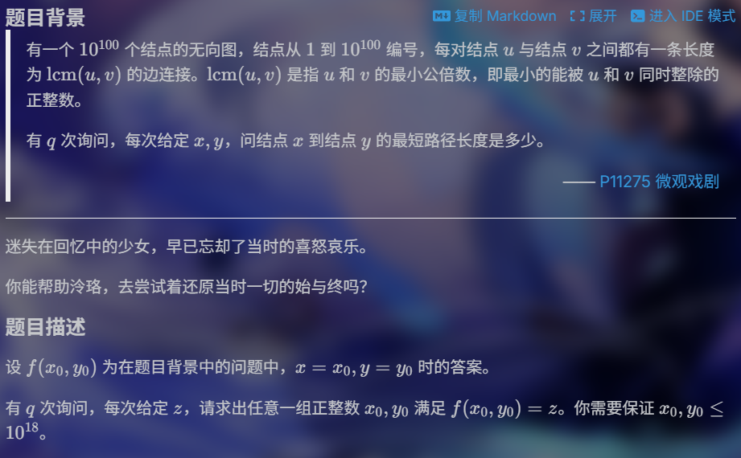
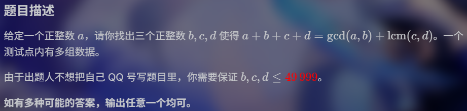

一天，矩阵群给我打来电话。他说：“你敢不敢和我举行 OI 比赛？”

<!-- more -->

一天，矩阵群给我打来电话。他说：“你敢不敢和我举行 OI 比赛？”我豪爽的答应了：“我当然敢！”，周一下午在luogu.com.cn举行，谁不来谁就是怂货。

我原本以为我恐吓了矩阵群，矩阵群应该躲在家，不敢找我，可正当这时，我听见了音乐声，原来是我手机响了，一看，竟然是矩阵群打来的电话，他还真有勇气，我接通了电话，听道电话那头骂道：“小废物，你怎么还不来，再不来你的脑子就被我搞坏了。”我听到他对我的毒骂之后，我回骂道：“我要把你挂到我的犇犇上，帮你炒作一番，你说好不好啊。”

他吓得没再回应我，可是到了周日，矩阵群竟然又给我打电话了，他还真要和我举行一场OI大战，于是我按照约定，到达了luogu.com.cn，可他已经等我很久了，题目甚至已经在 APIO 举办前就出好了。

这可是比 APIO 更魔怔的比赛

第一道题，我占今上风，他比不过我，到了第六回合，他就主动认输了。

第二道题，他开始占上风，我也不甘势弱，我们僵持了一百多个回合，我因为轻敌，被他击败了。

从那时开始，我就不轻敌了，我认真研究他的套路，看了看 P11036 ，于是我总结出了一种方案。

第二天，还是那道题，他使用祖传的题目，进行了超级大加强，对我发动猛烈的攻击，我们并不势均力敌，并不平分秋色，旦我们比了3个多小时，最后我还是败了。

后来，我不知不觉的睡着了，他趁着这个好机会，一记构造大赛，一飞冲天，剩下的题业完全都是构造题，打的我不敢动键盘，对我的打击比棕名还大。