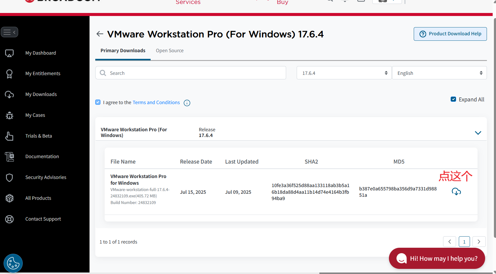
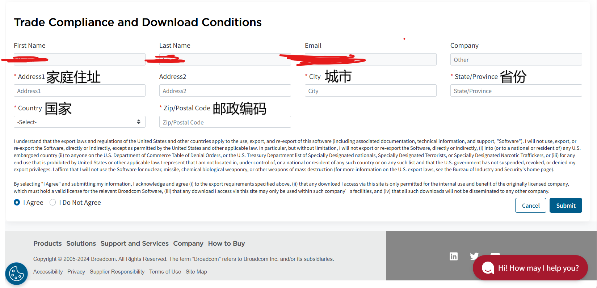

现在环境也是好起来了，VMware Workstation都可以免费使用了。

只是。。。想下载可能会有点麻烦。

<!-- more -->

# 前言：最简单的方法

在网上找到别人已经下载好的安装包链接给他下载下来就完事了，不用在注册什么账户啊什么的。

# 下载安装包

## 注册账号
~~打开[官网](https://www.vmware.com/products/desktop-hypervisor/workstation-and-fusion)~~

不用那么麻烦了，直接注册 [BROADCOM](https://profile.broadcom.com/web/registration) 就好了，我也不知道为什么，现在下载安装包要去这个网站上下载。

输入你的邮箱（提醒，还不能用163邮箱，十分恶行，所以，能简单还是简单点吧），然后把验证码填了，点击 `Next`，

验证码填一下，再点击 `Continue`，

这边其实可以随便填，填好后下一步，

然后点 `I'll do it later`

现在你就注册好了 BROADCOM 账号，接下来就是，下载安装包。

## 下载安装包

打开[下载链接](https://support.broadcom.com/group/ecx/productdownloads?subfamily=VMware%20Workstation%20Pro&freeDownloads=true)**页面**

选择自己系统版本点击，

自己爱下什么版本就爱下什么版本，我个人觉得越新越好啦，

然后又很恶心的地方来了，懒得写了你们直接看图片吧。

然后再点那个下载按钮就好

## 安装

安装过程自己应该都会吧（
