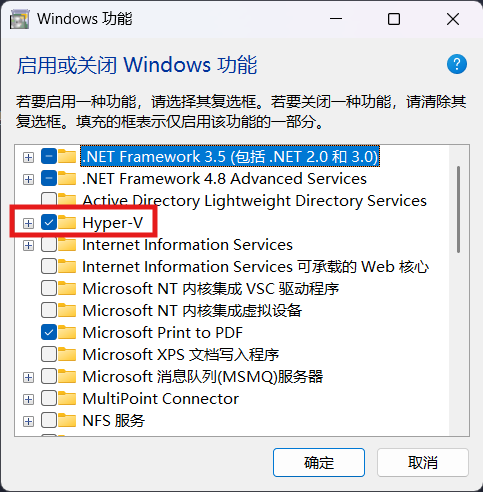
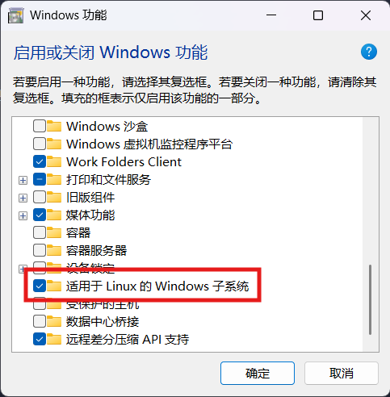
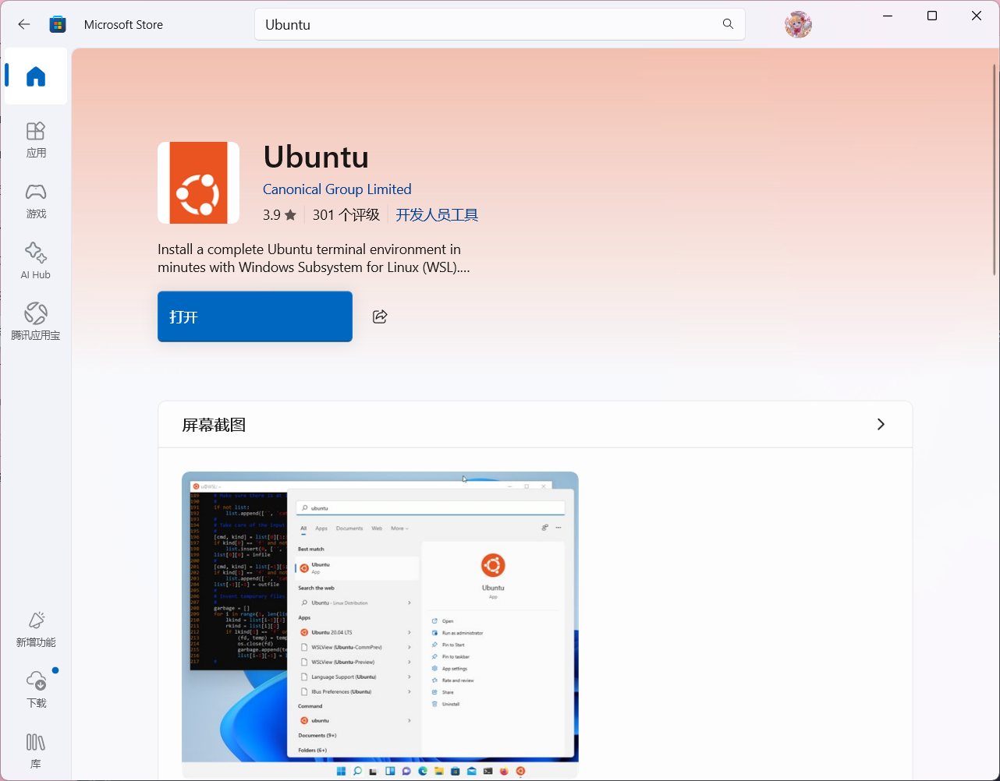
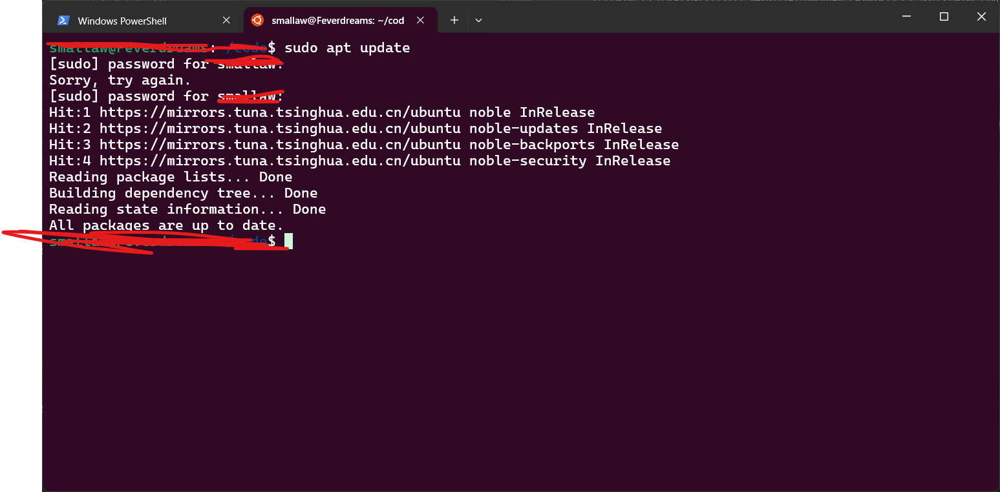

如果你依赖着 Windows 上丰富的游戏与软件，但同时又是个程序员，得装个 Linux 为了搞开发，又不想耗费大量储存弄双系统，请看看这篇博客。

<!-- more -->

# 前言

WSL(Windows Subsystem for Linux)，适用于 Linux 的 Windows 子系统，现在已经非常成熟了，随着 wsl2 的发布，更是支持了 gui 界面，

在 Windows 10 版本 2004 及更高版本（内部版本 19041 及更高版本）或 Windows 11 都能够使用，大大减少了开发 Linux 程序的成本（？存疑）。

总之就是非常方便搞 Linux 开发。

# 功能开启

请确保是管理员用户，打开控制面板，搜索“功能”，点开“启用或关闭 Windows 功能”，勾选 “Heper-V” 以及 适用于 “Linux 的 Windows 子系统”。




等待功能所需文件下好后，重启系统（PS：确保该保存的文件已经保存）

# 安装 wsl

以管理员身份运行终端，键入
```sh
wsl --update
```
这个命令将安装运行 WSL 所需的所有内容。

重启计算机。

# 安装发行版系统

## 微软商店法

打开 Microsoft Store，搜索你喜欢的 Linux 系统分支，这里以 Ubuntu 为例，直接下载安装（这步操作建议关闭梯子）。


## 命令行法

以管理员身份运行终端，键入
```sh
wsl.exe --install [Distro]
```
其中 [Distro] 字段改为你喜欢的 Linux 发行版，不键入默认为 Ubuntu。

# 设置 Linux 用户信息

在开始菜单内找到 wsl 并打开，如果你使用微软商店安装发行本，则在开始菜单能够直接找到你安装的发行版。

初次打开会提示你键入用户名（UNIX username）与用户密码。

>此用户名和密码特定于安装的每个单独的 Linux 分发版，与 Windows 用户名**无关**。

> 请注意，输入**密码**时，屏幕上不会显示任何内容。 这称为盲人键入。 你不会看到你正在键入的内容，这是完全正常的。

> 此帐户将被视为 Linux 管理员，能够运行 sudo (Super User Do) 管理命令。

设置完后，你就可以愉快地在 Windows 里~~流畅地（应该吧~~使用 Linux 系统啦！



# 文件系统

在 Windows 里，你可以在文件管理器中找到“Linux”字样，你也可以在 Linux 终端里键入 `explore.exe .` 以在 windows 文件资源管理器中打开当前目录。（确保最后的“.”已输入）

在 Linux 里，通过导航到“/mnt”，可以直接访问 Windows 上的文件，例如 `cd /mnt/c` 可以跳转到 Windows 上的 C 盘目录。

# GUI？请安装 WSL2

从 wsl2 开始支持显示 Linux 程序的 GUI 界面。

键入以下命令以检查你的 wsl 版本
```sh
wsl --list
```
如果关键字“VERSION”对应的不是 2，请再键入以下命令升级至 wsl2
```sh
wsl --set-default-version 2
```
这样你就可以查看 GUI 界面啦！

# 使用感言

真的很建议尝试一下，真的很好用